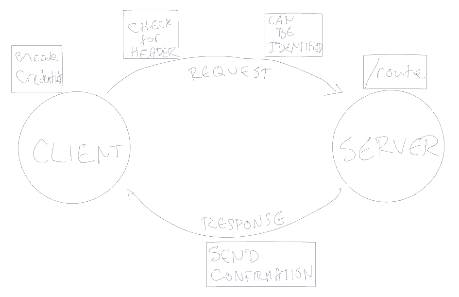

# Basic Authentication Server

## INSTALLATION

* clone repo to your local machine
* run `npm install` to install dependencies

## Problem Domain

### Phase 1

* Users can create a new account so they can login later
* Users can login

## UML

## LINKS

[HEROKU SERVER](https://justin-authentication-server.herokuapp.com/)

## ROUTES

REST Methods:  

* POST
  * /signin
    * uses authentication header to compare encoded data stored in the database

* POST
  * /signup
    * creates new user data from JSON object or form data with the two keys `username` and `password`
